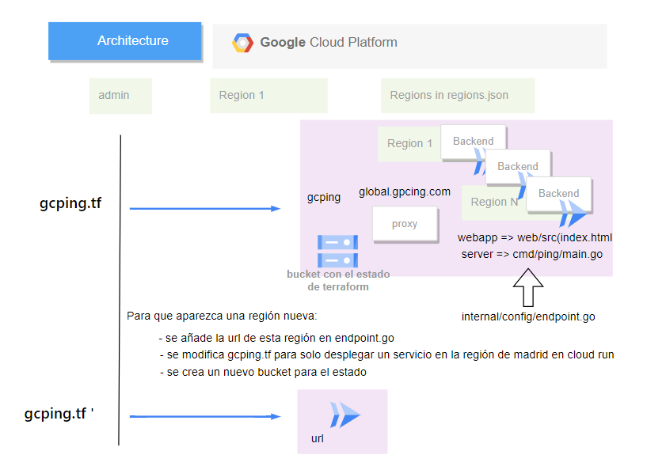

# gcping

[](https://github.com/GoogleCloudPlatform/gcping/actions/workflows/tests.yml)

Se propone añadir la región de Madrid.



Se observa como está desplegado en cloud run:


Se a;ade la siguiente url:

```

    "europe-west1": {
		URL:        "https://europe-west1-5tkroniexa-ew.a.run.app",
		Region:     "europe-west1",
		RegionName: "Belgium",
	},
    "europe-southwest1": {
        URL:        "https://madrid1-iaka3uvbxq-ew.a.run.app",
        Region:     "europe-southwest1",
        RegionName: "Madrid",
    },
```


----------------------------

gcpping is both a command line tool and a webapp that reports median latency to
Google Cloud regions. The webapp is hosted at [gcping.com](http://gcping.com).
To install the command line tool, see below.

Note: This is not an official Google product.

## CLI Usage

```
gcping [options...]

Options:
-n   Number of requests to be made to each region.
     By default 10; can't be negative.
-c   Max number of requests to be made at any time.
     By default 10; can't be negative or zero.
-r   Report latency for an individual region.
-t   Timeout. By default, no timeout.
     Examples: "500ms", "1s", "1s500ms".
-top If true, only the top (non-global) region is printed.

-csv CSV output; disables verbose output.
-v   Verbose output.

Need a website version? See gcping.com
```

An example output:

```
$ gcping
 1.  [global]                   11.17568ms
 2.  [us-central1]              12.373109ms
 3.  [us-west3]                 29.203499ms
 4.  [northamerica-northeast2]  30.615139ms
 5.  [us-east4]                 33.401098ms
 6.  [northamerica-northeast1]  38.612769ms
 7.  [us-west1]                 43.041808ms
 8.  [us-east1]                 46.847258ms
 9.  [us-west4]                 53.438688ms
10.  [us-west2]                 57.659108ms
11.  [europe-west2]             103.371016ms
12.  [europe-west4]             111.966565ms
13.  [europe-west1]             112.327356ms
14.  [europe-west3]             114.245525ms
15.  [europe-west6]             118.966225ms
16.  [europe-central2]          128.008935ms
17.  [europe-north1]            136.796505ms
18.  [asia-northeast1]          142.480775ms
19.  [southamerica-east1]       147.324384ms
20.  [asia-northeast2]          156.088594ms
21.  [asia-northeast3]          168.205243ms
22.  [asia-east2]               170.763954ms
23.  [australia-southeast2]     188.310153ms
24.  [southamerica-west1]       206.412352ms
25.  [asia-southeast2]          210.029872ms
26.  [asia-south1]              256.2628ms
27.  [asia-south2]              276.434709ms
28.  [australia-southeast1]     396.915245ms
29.  [asia-east1]               417.147963ms
30.  [asia-southeast1]          496.648151ms
```

```
$ gcping -r us-east1
502.068712ms
```

```
$ gcping -top
us-west2
```

## Installation

We build binaries for the following OS's and architectures:

* Linux 64-bit: https://storage.googleapis.com/gcping-release/gcping_linux_amd64_latest
* Mac 64-bit (x86): https://storage.googleapis.com/gcping-release/gcping_darwin_amd64_latest
* Mac 64-bit (Apple Silicon): https://storage.googleapis.com/gcping-release/gcping_darwin_arm64_latest
* Windows 64-bit: https://storage.googleapis.com/gcping-release/gcping_windows_amd64_latest

Installation looks something like this (changing the URL for your system):

```
curl https://storage.googleapis.com/gcping-release/gcping_linux_amd64_latest > gcping && chmod +x gcping
```
